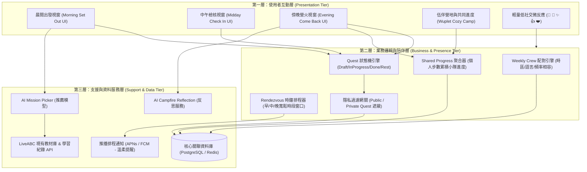
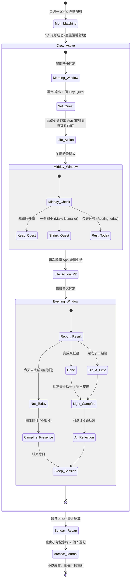

# 伍伴 Wuplet 產品開發藍圖
### Cooperative Personal To-Do × Weekly Crew × Real-life Action
**藍圖版本**：v2.0（六大架構規範版） ｜ **整理發布日期**：2026-09-12
**專案專題對應**：希伯崙 LiveABC「AI英語互動學習設計 / AI英語創新教學設計」成果專題 ＆ 獨立版行動陪伴工具

> 💬 「大家各自在過自己的人生，只是在往前的路上，剛好有幾個人同行。」

---

## 📌 執行摘要（Executive Summary）
伍伴 Wuplet 是一個以「每週固定五人同行」為核心的 Cooperative Personal To-Do（合作式個人待辦）產品。每個人做自己的事，但個人完成的小任務會轉化為小隊的共同進度；App 只在一天中三個短暫時刻（晨間出發、中午檢核、傍晚歸隊）提供低負擔陪伴與柔性承接，其餘時間鼓勵使用者離開手機、回到真實生活行動。產品核心不是更多教材或聊天機器人，而是將「低負擔社會陪伴（Social Presence）」、「柔性責任感（Soft Accountability）」與「共同累積（Shared Progress）」置於行動之前，徹底打破自主學習與個人成長的啟動拖延困境。

### 開發藍圖六大架構對應總覽
本開發藍圖嚴格依據《開發藍圖六大架構》標準收錄與重組：

| 架構編號 | 六大架構核心項目 | 核心定義與交付內容 | 對應文件章節 |
| :--- | :--- | :--- | :--- |
| **第一架構** | **產品定義書** | 一句話講清楚為誰、解決什麼問題。含核心命題、品牌主張、非目標界定與九大原則 | 第 1 章 |
| **第二架構** | **User Story** | 主要使用者想做什麼、為了什麼價值。含 4 大 Persona、核心需求矩陣與驗收標準 | 第 2 章 |
| **第三架構** | **功能規格表** | 功能、使用者可以…、規則、優先度。含完整功能矩陣、雙版本對照與 AI 規格 | 第 3 章 |
| **第四架構** | **架構圖 & 資料模型** | 三層式架構，加上資料結構定義。含三層系統圖、10 大實體定義與隱私權限矩陣 | 第 4 章 |
| **第五架構** | **狀態流 & 畫面示意** | 狀態機，加上主要頁面示意圖。含一週/每日/任務狀態流與 5 大高品質畫面導覽 | 第 5 章 |
| **第六架構** | **素材清單 & 範圍** | 資料來源，加上 MVP 先做 / 先不做。含資料源、素材盤點、版本切分與 A/B 測試 | 第 6 章 |

---

## 1. 產品定義書（Product Definition Document）
*一句話講清楚為誰、解決什麼問題、為何值得做*

### 1.1 一句話核心定義
> **產品核心定義**：伍伴 Wuplet 是一個以「每週固定五人同行」為核心的 Cooperative Personal To-Do（合作式個人待辦）產品：每個人做自己的事，個人完成的小任務轉化為小隊的共同進度；App 只在一天中三個短暫時刻提供輕量陪伴，其餘時間鼓勵使用者離開手機、投入真實生活行動。

### 1.2 核心命題（Core Proposition）
使用者不一定缺乏目標，也不一定缺乏資源；真正的卡點是「身邊沒有人、選擇太多、啟動阻力過高，導致明明想進步卻遲遲沒有開始」。伍伴透過固定小隊的存在，讓個人的微小行動被看見、被承接、被累積，而不是被評比或監督。

### 1.3 企業實務痛點與使用者痛點分析
#### 🔸 企業實務痛點（LiveABC 希伯崙數位學習情境）
- 【教材庫龐大但選擇癱瘓】：LiveABC 擁有豐富的 AI 口說、互動雜誌、聽力與影音單元，但自主學習者打開 App 面對海量目錄時，往往產生決策疲勞，不知道今天該挑哪一篇，最後退出。
- 【有資源不等於有行動】：學習平台最大的流失瓶頸不在於教材品質，而在於「教材之前」的啟動障礙；學員缺乏在場感與外部推力，容易三天打魚兩天曬網。
- 【孤立學習缺乏同儕在場感】：缺乏實體班級與固定同儕時，學習變成高度考驗自律的苦差事，只要工作一累就容易中斷，難以形成穩定的自主學習習慣。

#### 🔸 使用者個人痛點（自主學習與個人待辦情境）
- 【大量匿名人數無效且增壓】：「182 人正在學習」之類的 Social Proof 數字，只讓人感到冷漠的績效與競爭，無法產生「有人跟我同行」的情緒共鳴，甚至帶來心理壓力。
- 【傳統 To-Do 工具孤立無援】：Trello、Notion、Todoist 適合專案管理，但對個人自發性微行動缺乏情感支持，列了一堆清單反而產生拖延負擔。
- 【打卡懲罰與全勤羞辱的負面效應】：傳統習慣養成 App 強調 Streak（連續天數）與排行榜，一旦有一天中斷就被重設或罰款，容易引發「乾脆全放棄」的破罐破摔心態。

### 1.4 品牌主張與價值矩陣
| 品牌主張 / 口號 | 應用情境與精神定位 |
| :--- | :--- |
| **各自生活，有伴前進。** | 中文核心品牌句：詮釋獨立自主與溫暖同行的共存哲學 |
| **Learn on your own. Never start alone.** | 自主學習版核心訴求：每個人學自己的，但絕不孤單起步 |
| **Your effort becomes our progress.** | 共同進度核心精神：個人付出的每 5 分鐘，都是小隊共同前進的一步 |
| **Meet briefly. Live fully. Come back together.** | 相聚哲學：晨午晚三次短暫見面，其餘時間全力投入真實生活 |
| **App 不能替你生活，它只能陪你出去生活。** | 產品設計底線：拒絕成癮與留存綁架，以用戶在真實世界的行動為榮 |

### 1.5 邊界界定：產品「不是」什麼（What It Is NOT）
| 邊界禁區 | 具體排除說明與產品理念 |
| :--- | :--- |
| ❌ **不是工作專案管理工具** | 不是主管分派任務給員工的協作軟體，非 Trello/Asana，不做任務分派、工時統計與依賴追蹤。 |
| ❌ **不是高社交聊天室或交友軟體** | 沒有公開動態牆（Feed）、沒有隨機陌生人私訊（DM）、沒有公開評論區，第一版刻意壓低社交密度。 |
| ❌ **不是高壓自律打卡或懲罰競技場** | 拒絕排行榜競賽、拒絕連續天數中斷羞辱、拒絕懲罰金機制；休息日正式合法，不作道德綁架。 |
| ❌ **不是留客時長的成癮遊戲** | 核心任務（Quest）發生在現實線下世界；虛擬營地只是行動的回饋映射，不靠刷時長玩遊戲。 |
| ❌ **不是把 AI 當主要陪伴主角** | 真人同儕的存在才是陪伴的主體；AI 擔任減輕決策負擔的「助推副手（Nudge Assistant）」，絕不越俎代庖。 |
| ❌ **不是學習成效認證或監考系統** | 外部自修與生活任務採信用制（Honor System）；產品相信使用者，不假裝能用 AI 驗證心靈是否真正內化。 |

### 1.6 產品設計九大核心原則
| 原則核心 | 具體設計意義與落實方式 |
| :--- | :--- |
| 🌿 **陪伴，不監督** | 伙伴的存在意義是「我知道你也在努力」，絕非相互檢查、催促進度或公開懲處。 |
| 🌿 **合作，不競爭** | 個人努力轉化為小隊的共同累積；介面不做成員排名，不標註「貢獻最低者」。 |
| 🌿 **小步，不施壓** | 2分鐘、5分鐘、「Did a little」都是實質前進；核心目標是「啟動」，而非追求最大化工時。 |
| 🌿 **短暫見面，回到生活** | 一個成功的 Session 結尾不是讓使用者繼續刷手機，而是心滿意足地關閉 App 走向真實世界。 |
| 🌿 **隱私是權利，不是獎勵** | Private Quest 無使用次數上限；使用者隨時有權隱藏任務內容，保護私人生活邊界。 |
| 🌿 **相信使用者（Honor System）** | 線下任務回報基於完全信任制；產品是同行的夥伴，不是防弊的監考官。 |
| 🌿 **休息合法（Rest Day）** | 「Resting today」是系統一等公民狀態，零分鐘不等於失敗，拒絕任何愧疚感設計。 |
| 🌿 **推薦優先、選擇其次** | 尤其在 LiveABC 模組中，先給予一個最清晰的單一推薦，僅在使用者需要時才展開替換選單。 |
| 🌿 **人是主角，AI 是助推** | AI 專注於「降低挑選摩擦」與「結構化反思引導」，不替代真人的陪伴溫度。 |

---

## 2. User Story（使用者故事）
*主要使用者想做什麼、為了什麼價值*

### 2.1 目標族群與 Persona 畫像
#### 👤 Persona 1：自主學習者 Emily（26歲，外商行政助理）
想利用下班時間加強英語口說，但每天回家坐在沙發上滑手機就過了兩小時。她不需要老師盯人，只希望每天打開 App 時知道有人也正在學，讓自己能順利啟動 10 分鐘練習。

#### 👤 Persona 2：重視隱私自修者 David（32歲，軟體工程師）
正在準備轉職作品集與技術閱讀，但他非常排斥在社群軟體上被熟人評頭論足，也不想讓陌生人知道具體細節。他需要低干擾的同行陪伴，並能把任務完全設為 Private。

#### 👤 Persona 3：低能量易焦慮者 Zoe（24歲，專案執行）
工作壓力大，常常加班到很晚。過去使用打卡軟體常因加班中斷 Streak 而感到沮喪放棄。她需要一個允許「只做 3 分鐘」或「今天正式休息」而不會有任何罪惡感的友善工具。

#### 👤 Persona 4：LiveABC 數位學員 Kevin（20歲，大學生）
購買了 LiveABC 數位教材，但面對琳瑯滿目的課程單元總是出現選擇障礙。他希望早上直接有人幫他挑出一個符合今天可用時間（如 8 分鐘）的單元，按一個按鈕就開始做。

### 2.2 非核心客群（MVP 刻意排除者）
- ⚠️ 需要學校/企業正式學分認證與嚴格成績考核者（MVP 不提供防作弊監考）。
- ⚠️ 追求在社群動態牆炫耀戰績、吸引粉絲點讚與即時私訊社交者（本產品刻意低社交）。
- ⚠️ 需要多專案甘特圖、嚴密工時估算與權限管理的企業團隊（非本產品定位）。
- ⚠️ 崇尚「沒達成扣 1000 元」等極限自我懲罰或賭博式承諾的硬核自律者。

### 2.3 行為心理學轉向：從 Social Proof 到 Shared Progress
傳統產品思維常依賴「Social Proof（社會認同）」，例如提示「全台有 5,280 人正在線上學習」，但心理學研究與使用者反饋表明，冷冰冰的大規模數據只會加深孤立感與競爭焦慮。伍伴推動向「Shared Progress（小隊共同累積）」的典範轉移：將團體縮小至 5 位固定、具體且具可辨識 Avatar 的同行者，每個人做的事情各不相同，但每個人付出的微小努力都會共同點亮營火與花園，建立「我們正在一起走」的心理安全感。

### 2.4 完整 User Story 需求規格矩陣
| 編號 | 角色與情境 | User Story（需求陳述） | 核心價值 | 驗收準則（Acceptance Criteria） |
| :--- | :--- | :--- | :--- | :--- |
| **US-01** | 自主學習者 | 身為一個想自我提升但獨處容易拖延的學習者，我希望每天早上只需認領 1 件微小任務，並看見另外 4 位伙伴也各自在做事，讓我能自然跨過啟動門檻。 | **降低啟動摩擦，獲得同行在場感** | 1. 晨間介面明確展示 4 位隊友頭像與預定小任務；2. 任務設定流程在 3 步驟內完成；3. 設定完成後系統引導退出 App。 |
| **US-02** | 重視隱私者 | 身為不想向他人公開私密目標的使用者，我希望隨時將任務切換為 Private Quest，使我能專心前進而無需顧慮他人眼光。 | **保護個人心理邊界與隱私安全** | 1. 設定任務時提供 Private 切換開關；2. 隊友僅能看見「Working on a private quest」；3. Private 功能無次數或付費門檻限制。 |
| **US-03** | 疲憊與低能量日 | 身為中午發現上午進度落後且感到疲憊的使用者，我希望一鍵把任務「縮小為 5 分鐘版本」或改為「今天休息」，使我不會因為完美主義而徹底放棄。 | **防止破罐破摔，維持自尊與彈性** | 1. 中午相遇介面提供「維持原任務」、「縮小任務（Make it smaller）」、「休息（Rest today）」三個選項；2. 縮小任務後隊友看到溫和更新；3. 無任何負面警示。 |
| **US-04** | 外部行動實踐者 | 身為在真實世界中完成閱讀、運動或紙本筆記的使用者，我希望在晚間僅透過簡單回報（Done / Did a little / Not today）完成記錄，不必耗時拍照錄影上傳證明。 | **貫徹信任機制，保護輕盈體驗** | 1. 晚間回報介面僅需單擊選擇狀態；2. 選擇「Did a little」同樣計入有效行動並獲取小隊微光貢獻；3. 不強制要求文字心得或拍照證明。 |
| **US-05** | LiveABC 學員 | 身為面對大量教材感到選擇癱瘓的學員，我希望系統根據我今天的可用時間（如 8 分鐘）直接推薦 1 個最適合的單元，讓我一鍵 Deep Link 開始學習。 | **消除選擇疲勞，打通教材啟動閉環** | 1. AI Mission Picker 依據時間、能量與偏好直接輸出單一推薦單元；2. 附帶「換一個」備選按鈕；3. 點擊「出發」直接喚起 LiveABC 對應教材。 |
| **US-06** | 內向社恐使用者 | 身為害怕打字聊天但渴望被關注的使用者，我希望僅透過輕量微反應（🌱、👏、✨）向隊友互致溫暖，享有社群支持而無社交耗能負擔。 | **極低社交能耗，免除人際壓力** | 1. 系統僅提供 5 款預設微反應按鈕；2. 不提供文字留言、私訊與討論串；3. 收到反應時以溫暖小動效呈現。 |
| **US-07** | 團隊奉獻感受者 | 身為渴望被肯定的小隊成員，我希望我完成的小任務能轉化為小隊營地的木柴或微光，使我感受自己的每一步都在為團隊世界帶來美好變化。 | **放大個人微步的社會意義** | 1. 個人回報完成後，團隊進度條與營地視覺立即產生微光反饋；2. 呈現團隊今日總累積，但不顯示個人貢獻名次排行。 |
| **US-08** | 沈澱成長反思者 | 身為完成任務後想要有所沉澱的使用者，我希望在晚間營火前收到 AI 提出的 1~2 題結構化啟發式問題，幫助我快速回顧今天並累積成就感。 | **強化正向心理回饋與自我認同** | 1. 晚間完成後可選觸發 AI Reflection；2. 對話限制在 2 分鐘與 2 題以內，專注正向動機挖掘；3. 產出金句收錄至個人回顧。 |
| **US-09** | 休整合法人性者 | 身為今天生病或極度需要喘息的使用者，我希望在標記「Resting today」後，團隊進度不受懲罰扣減，也不被標記為落後，讓我安心調養。 | **去罪惡感設計，尊重真實人性節律** | 1. 休息日正式標記為「Resting today」；2. 營火場景中角色呈舒適安歇姿勢；3. 不扣減小隊任何數值與資源。 |
| **US-10** | 週度旅程回顧者 | 身為走完一週的同行者，我希望在週日晚上看見小隊這一週共同完成的營地紀念與自己的行動足跡，帶著圓滿感迎接下週新的旅程。 | **儀式感沉澱與循環驅動力** | 1. 週日晚間生成小隊紀念物（如一棵盛開的樹/點亮的營燈）；2. 個人微光週記客觀列出出勤與縮小任務痕跡；3. 溫馨道別並引導下週重新組隊。 |

---

## 3. 功能規格表（Functional Specifications）
*功能、使用者可以…、規則、優先度*

### 3.1 完整功能規格總表（Functional Matrix）
| 模組名稱 | 功能項目 | 使用者可以… | 核心規則與邊界限制 | 優先度 |
| :--- | :--- | :--- | :--- | :--- |
| M1: 帳號引導 | **新進成員註冊與偏好設定** | 設定個人暱稱、挑選初始 Wuplet 角色外觀、勾選常態行動時段視窗與任務隱私預設。 | 1. 暱稱支援 2~12 字元；2. 預設隱私可選 Public 或 Private；3. 時段設定提供寬鬆區間（如早晨 07:30-09:30）。 | `P0（必做）` |
| M2: 小隊編組 | **Weekly Crew 一週五人配對** | 每週一自動加入 5 人同行小隊，與固定 4 位伙伴共同度過一週。 | 1. 嚴格限定 5 人一隊；2. 第一版採規則配對（時區、活躍時段相容度、語言）；3. 一週內不重新洗牌；4. 隊友間不展示真實姓名與電話。 | `P0（必做）` |
| M3: 晨間出發 | **Morning Set Out 意圖宣告** | 在晨間時段查看本週 4 位隊友，自訂或接受 1 個 Tiny Quest，確認後即刻啟程。 | 1. 每天嚴格限定設定 1 個主要任務；2. 任務建議時長 2~20 分鐘；3. 設定完成後系統主動顯示出發語並引導關閉 App；4. 進入視窗寬鬆（預設 2 小時彈性）。 | `P0（必做）` |
| M4: 中午檢核 | **Midday Check In 狀態關懷** | 在午間打開 App 查看隊友當前簡要動態，針對個人任務選擇「維持」、「一鍵縮小」或「今日休息」。 | 1. 縮小任務功能（Make it smaller）將原任務拆解為 5 分鐘微步；2. 選擇休息（Resting）即切換至休整狀態；3. 不展示落後警告或未達標標籤。 | `P0（必做）` |
| M5: 傍晚歸隊 | **Evening Come Back 營火回報** | 在晚間打開 App 回報今日執行結果（Done / Did a little / Not today），查看團隊營火與進度累積。 | 1. 三態彈性回報，信任制；2. 「Did a little」同樣獲得小隊貢獻點；3. 可選填 1 句簡短收穫；4. 晚間 Session 建議停留 3~5 分鐘內結束。 | `P0（必做）` |
| M6: 隱私任務 | **Private Quest 隱私保護模式** | 在建立或編輯 Quest 時，勾選 Private 開關，使隊友僅能感知其存在而無法窺探內容。 | 1. 隊友介面統一顯示「Working on a private quest」；2. 完成時顯示「Completed a private quest」；3. 無次數上限，永久免費開放。 | `P0（必做）` |
| M7: 輕量反應 | **Low-social Reaction 微表情互動** | 點擊隊友狀態卡片，發送 🌱（萌芽）、👏（鼓掌）、✨（微光）、👍（點讚）、❤️（暖心）。 | 1. 無文字評論輸入框；2. 無單向私訊聊天（No DM）；3. 每位成員每次碰面最多對同一隊友發送 1 次同款微反應，防止刷屏擾民。 | `P0（必做）` |
| M8: 共同進度 | **Shared Progress 小隊進度聚合** | 查看小隊今日與本週總累積成果（如完成 Step 數、團隊投入總分鐘數）。 | 1. 個人每完成 1 個任務貢獻 1 Step；2. 介面僅呈現小隊總進度與團隊里程碑；3. 嚴禁任何個人貢獻排行榜與「末位標註」；4. 休息日不扣團隊進度。 | `P0（必做）` |
| M9: 週度回顧 | **Weekly Recap 週日營火結算** | 週日晚間小隊齊聚營火，展示本週共同栽培的植物或點亮的燈塔，領取本週同盟紀念徽章。 | 1. 小隊共同生成 1 項虛擬紀念資產（儲存於個人 Journey Book）；2. 呈現本週隊友溫暖同行紀錄；3. 儀式結束後小隊和平解散，準備下週配對。 | `P0（必做）` |
| M10: AI 推薦 | **AI Mission Picker 智慧任務推薦** | 由系統 AI 依據「今日可用時間 + 當前精力狀態 + 個人學習偏好 + 歷史紀錄」精準推薦 1 個小任務。 | 1. 推薦原則：Recommendation First, Choice Second；2. 預設呈現單一可執行任務，提供「換一個」備選按鈕；3. LiveABC 版直接掛載 Deep Link 教材。 | `P1（延伸）` |
| M11: 虛擬營地 | **Wuplet Camp 營地視覺動態演進** | 小隊 5 隻角色環坐於營火旁，隨個人回報陸續帶回微光、枝葉或木柴，營地環境產生柔和光影變化。 | 1. 白天角色背小背包出發；2. 晚間回報後帶回發光種子；3. 休息者呈現舒適靠枕安睡狀態；4. 視覺以手繪溫暖童趣為核心，拒絕硬核數值。 | `P1（延伸）` |
| M12: AI 反思 | **Campfire AI Reflection 結構化微反思** | 晚間回報後，可解鎖與營火精靈的 2 分鐘反思對話，回答 1~2 題啟發性問題。 | 1. 限時 2 分鐘、最多 2 輪對話；2. 聚焦正向動機與成就提煉；3. 嚴格遵守護欄，不做情感諮商與心理診斷；4. 產出精簡反思小卡。 | `P2（增強）` |
| M13: 任務轉盤 | **Surprise Me 驚喜任務轉盤** | 針對嚴重選擇困難的使用者，系統從已適配的 3~5 個合規小任務中隨機轉盤抽取 1 個。 | 1. 轉盤池內僅包含已通過時長與難度篩選的候選任務，嚴禁隨機亂抽；2. 作為輔助娛樂化入口，不取代常態推薦。 | `P2（增強）` |
| M14: 營地裝扮 | **Cozy Assets 共同成果解鎖物件** | 小隊共同累積里程碑可解鎖營火小毯子、手沖咖啡壺、掛燈等營地溫馨裝飾品。 | 1. 解鎖物為小隊共同享有；2. 嚴禁任何課金充值數值加成；3. 純裝飾性與氛圍營造，不影響核心進度計算。 | `P2（增強）` |
| M15: 夥伴重逢 | **Reunion System 熟人與偶遇機制** | 對過去合作愉快、節奏合拍的隊友標記「好感同行者」，未來系統在週一配對時以加權機率再次撮合。 | 1. 仍維持 5 人陌生同行本質；2. 支援可選「好友房」（供自組讀書會使用）；3. 避免形成排他性小圈子霸凌。 | `Future（未來）` |

### 3.2 兩大落地版本功能對照矩陣
| 比較面向 | 版本 A：LiveABC 附加功能（企業專題主提案） | 版本 B：獨立 App「伍伴 Wuplet」（長遠泛用版） |
| :--- | :--- | :--- |
| **核心定位** | LiveABC 既有數位學習平台的「同行啟動層」 | 跨生活、工作與全能自我成長的行動陪伴工具 |
| **品牌呈現** | 融入 LiveABC 現有 App，定名為「同行學習模式 / Weekly Crew」 | 獨立獨立品牌：伍伴 Wuplet（原創 IP 世界觀） |
| **任務來源** | LiveABC 既有教材庫（AI口說單元、數位雜誌、影音聽力等） | 使用者自主輸入各領域任務（自修、閱讀、健身、寫作、個人專案） |
| **完成驗證** | 系統自動追蹤：透過教材 API 直接獲取完成狀態與學習時長 | 信任制 Honor System：使用者自主回報 Done / Did a little / Not today |
| **AI 核心作用** | AI Mission Picker：依據時間與目標在龐大教材庫中快速導流 | AI Mission Picker（任務拆解）+ AI Campfire Reflection + 週記生成 |
| **點數與獎勵** | 直接介接並累加 LiveABC 既有點數體系，可兌換教材或實體贈品 | Wuplet 營地植物養成、個人微光歷程收藏、每週同盟成就徽章 |
| **推廣與擴散** | 作為 LiveABC 會員留存促活利器，有效拉升每日登入率與完課率 | 向終身學習者、考研族、創作者、自由職業者等廣大個人行動市場擴散 |

### 3.3 AI 角色定義與功能規格邊界
> **AI 角色定位**：助推副手（Nudge Assistant），專注於「降低挑選摩擦」與「結構化正向反思」，嚴禁替代真人同儕的陪伴主體地位。

#### 🤖 AI Mission Picker（智慧任務推薦規格）
- **輸入參數**：1. 今日可用時間（如：5分鐘、10分鐘、15分鐘、20分鐘）；2. 當前精力狀態（Low energy / Normal / Focused）；3. 個人長期目標（練口說 / 聽力突破 / 擴充單字）；4. 近 7 天學習記錄。
- **推薦邏輯**：若精力為 Low energy，推薦輕鬆閱聽型微任務（如 5 分鐘生活情境聽力）；若精力為 Focused，推薦實戰口說單元；推薦結果必須是單一具體動作，不得給予清單讓使用者再次選擇。
- **輸出展示**：「【AI 口說單元】生活旅遊英語 — 咖啡館點餐練習（預估時長：8分鐘）」+ 【即刻出發】按鈕 + 【換一個】小字按鈕。

#### 🪵 Campfire AI Reflection（營火微反思規格）
- **輸入參數**：原定 Quest、實際執行時間、回報結果狀態、晨間精力自我標記。
- **反思規則**：每次反思嚴格限制在 1~2 輪對話內；問題必須引導內在正向歸因（例如：「即使今天很累，是什麼讓你仍願意完成這 5 分鐘？」）；禁止說教，禁止給出冗長建議；對話結束生成 30 字以內的微光金句收錄。
- **輸出呈現**：結構化鼓勵文字卡片，附帶微光沉澱動效。

#### 🛡️ AI 護欄與禁制規範（Guardrails）
- 【嚴禁心理診斷】：不得使用「你可能有憂鬱/焦慮傾向」等醫學或心理診斷語彙；情緒標籤僅限自我陳述（Low/Normal/Focused）。
- 【嚴禁監考打分】：不假裝 AI 能評估「學員是否真正理解或內化」，不根據回報字數或打卡速度打分。
- 【嚴禁長時間閒聊】：反思 Session 設置 2 分鐘硬性收尾邊界，對話結束時主動提示「好好休息，明天見」，避免用戶沉溺於 AI 虛擬聊天。

---

## 4. 架構圖 & 資料模型（Architecture & Data Model）
*三層式架構，加上資料結構定義*

### 4.1 三層式系統架構規範
伍伴系統採「三層式架構（Three-Tier Architecture）」設計，分別為：
1. 【使用者互動層（Presentation Tier）】：專注於輕量、溫暖、低停留時長的介面體驗，包含早中晚 Rendezvous 視窗、營地進度畫卷、微反應浮層與極簡任務設定。
2. 【業務邏輯與陪伴層（Business Logic & Presence Tier）】：核心中樞，負責 Weekly Crew 規則配對引擎、三次碰面時序排程器、Quest 狀態機轉換、Shared Progress 聚合計算、以及嚴密的隱私資料過濾器（Visibility Filter）。
3. 【支援與資料服務層（Support & Data Services Tier）】：底層基礎設施，包含 AI 推薦與結構化反思服務（LLM Agent）、LiveABC 現有教材庫介接 API、關聯式資料庫、推播通知排程服務（APNs / FCM）。

#### 系統架構拓撲圖（Mermaid）

### 4.2 核心資料模型實體結構表（Data Dictionary）
| 實體名稱 (Entity) | 欄位名稱 (Field) | 型態 (Type) | 約束 / 鍵 | 業務說明與邏輯規則 |
| :--- | :--- | :--- | :--- | :--- |
| **User (使用者)** | `user_id` | UUID | `PK` | 使用者全域唯一識別碼 |
| **User** | `nickname` | VARCHAR(24) | `NOT NULL` | 對外公開之暱稱，不要求真實姓名 |
| **User** | `avatar_id` | VARCHAR(32) | `NOT NULL` | 選擇之初始 Wuplet 角色識別碼（Sprouty / Peachi 等） |
| **User** | `timezone` | VARCHAR(32) | `DEFAULT 'Asia/Taipei'` | 使用者所在時區，供 Rendezvous 視窗對齊 |
| **User** | `default_privacy` | BOOLEAN | `DEFAULT false` | 任務預設隱私狀態（true 為 Private） |
| **User** | `morning_window` | TIME_RANGE | `DEFAULT '07:30-09:30'` | 個人晨間出發常用時段區間 |
| **User** | `evening_window` | TIME_RANGE | `DEFAULT '20:00-22:30'` | 個人傍晚營火常用時段區間 |
| **User** | `liveabc_uid` | VARCHAR(64) | `NULLABLE` | 串接 LiveABC 現有帳號之識別碼（版本 A 使用） |
| **Crew (每週五人小隊)** | `crew_id` | UUID | `PK` | 小隊唯一識別碼 |
| **Crew** | `week_start_date` | DATE | `NOT NULL` | 當週小隊啟動日期（固定為週一零點） |
| **Crew** | `status` | ENUM | `NOT NULL` | 小隊狀態：Matching, Active, Completed, Archived |
| **Crew** | `total_steps` | INTEGER | `DEFAULT 0` | 小隊全體本週累計完成之微步數 |
| **Crew** | `world_seed` | INTEGER | `NOT NULL` | 共同營地場景隨機種子碼 |
| **CrewMember (小隊成員關聯)** | `crew_id` | UUID | `FK -> Crew` | 所屬小隊識別碼 |
| **CrewMember** | `user_id` | UUID | `FK -> User` | 成員使用者識別碼 |
| **CrewMember** | `joined_at` | TIMESTAMP | `NOT NULL` | 加入小隊時間戳記 |
| **CrewMember** | `seat_number` | SMALLINT | `1 ~ 5` | 營火座位編號（1 至 5 號固定席次） |
| **Quest (每日任務)** | `quest_id` | UUID | `PK` | 任務唯一識別碼 |
| **Quest** | `user_id` | UUID | `FK -> User` | 所屬使用者識別碼 |
| **Quest** | `crew_id` | UUID | `FK -> Crew` | 所屬小隊識別碼 |
| **Quest** | `quest_date` | DATE | `NOT NULL` | 任務生效日期 |
| **Quest** | `title` | VARCHAR(120) | `NOT NULL` | 任務標題（例：完成 1 個 AI 口說單元） |
| **Quest** | `estimated_mins` | INTEGER | `2 ~ 30` | 預估投入分鐘數（預設 10 分鐘） |
| **Quest** | `is_private` | BOOLEAN | `DEFAULT false` | 是否為隱私任務（隊友是否隱藏標題） |
| **Quest** | `source_type` | ENUM | `NOT NULL` | 來源：LIVEABC_AUTO, USER_CUSTOM, AI_RECOMMENDED |
| **Quest** | `external_ref` | VARCHAR(128) | `NULLABLE` | LiveABC 教材單元識別碼或 DeepLink URL |
| **Quest** | `status` | ENUM | `NOT NULL` | 狀態：PLANNED, SHRUNK, RESTED, COMPLETED |
| **QuestResult (任務結果)** | `result_id` | UUID | `PK` | 結果唯一識別碼 |
| **QuestResult** | `quest_id` | UUID | `FK -> Quest` | 對應任務識別碼 |
| **QuestResult** | `completion_state` | ENUM | `NOT NULL` | 回報結果：DONE, DID_A_LITTLE, NOT_TODAY |
| **QuestResult** | `actual_mins` | INTEGER | `NULLABLE` | 實際投入時間（僅作個人紀錄，不作排名） |
| **QuestResult** | `reflection_note` | VARCHAR(140) | `NULLABLE` | 個人選填之 1 句微光感言 |
| **QuestResult** | `reported_at` | TIMESTAMP | `NOT NULL` | 回報時間戳記 |
| **DailyState (每日狀態)** | `state_id` | UUID | `PK` | 狀態唯一識別碼 |
| **DailyState** | `user_id` | UUID | `FK -> User` | 使用者識別碼 |
| **DailyState** | `record_date` | DATE | `NOT NULL` | 紀錄日期 |
| **DailyState** | `energy_level` | ENUM | `NOT NULL` | 精力標記：LOW_ENERGY, NORMAL, FOCUSED |
| **DailyState** | `is_resting` | BOOLEAN | `DEFAULT false` | 今天是否宣告休整（Resting today） |
| **DailyState** | `midday_action` | ENUM | `NULLABLE` | 午間動作：KEPT, SHRUNK, RESTED, MISSED |
| **Contribution (小隊貢獻)** | `contrib_id` | UUID | `PK` | 貢獻紀錄唯一識別碼 |
| **Contribution** | `crew_id` | UUID | `FK -> Crew` | 受益小隊識別碼 |
| **Contribution** | `user_id` | UUID | `FK -> User` | 貢獻成員識別碼 |
| **Contribution** | `step_val` | INTEGER | `DEFAULT 1` | 貢獻步數（Done/Did a little 均為 1） |
| **Contribution** | `created_at` | TIMESTAMP | `NOT NULL` | 貢獻生成時間 |
| **Reaction (微表情互動)** | `reaction_id` | UUID | `PK` | 微反應識別碼 |
| **Reaction** | `crew_id` | UUID | `FK -> Crew` | 所在小隊識別碼 |
| **Reaction** | `from_user_id` | UUID | `FK -> User` | 發送者識別碼 |
| **Reaction** | `to_user_id` | UUID | `FK -> User` | 接收者識別碼 |
| **Reaction** | `emoji_type` | ENUM | `NOT NULL` | 表情符號：SPROUT, CLAP, SPARKLE, THUMBSUP, HEART |
| **Reaction** | `sent_at` | TIMESTAMP | `NOT NULL` | 發送時間 |
| **WorldState (共同世界營地)** | `world_id` | UUID | `PK` | 營地狀態唯一識別碼 |
| **WorldState** | `crew_id` | UUID | `FK -> Crew` | 對應小隊識別碼 |
| **WorldState** | `camp_level` | INTEGER | `1 ~ 5` | 營火繁盛等級（隨 total_steps 晉升） |
| **WorldState** | `garden_asset` | VARCHAR(64) | `NOT NULL` | 本週共同孕育之標誌物（例：小橡樹 / 溫馨營燈） |
| **WorldState** | `updated_at` | TIMESTAMP | `NOT NULL` | 最後更新時間 |
| **WeeklyJournal (每週個人週記)** | `journal_id` | UUID | `PK` | 週記唯一識別碼 |
| **WeeklyJournal** | `user_id` | UUID | `FK -> User` | 使用者識別碼 |
| **WeeklyJournal** | `crew_id` | UUID | `FK -> Crew` | 當週同行小隊識別碼 |
| **WeeklyJournal** | `active_days` | INTEGER | `0 ~ 7` | 本週出席行動天數 |
| **WeeklyJournal** | `shrunk_count` | INTEGER | `0 ~ 7` | 彈性縮小任務次數（正面標記彈性智慧） |
| **WeeklyJournal** | `rest_days` | INTEGER | `0 ~ 7` | 合法休整天數 |
| **WeeklyJournal** | `ai_summary` | TEXT | `NULLABLE` | 由 AI 生成之溫暖客觀回顧文字 |

### 4.3 隱私權限與資料能見度控制矩陣（Data Visibility Matrix）
| 資料項目 | 小隊伙伴可見性 (Peer View) | 隊友不可見 (Hidden) | 系統與 AI 內部計算使用 (System/AI) |
| :--- | :--- | :--- | :--- |
| **使用者暱稱 & Avatar** | ✅ 完全可見（作為同行識別） | ❌ 真實姓名、手機號不公開 | ✅ 用於配對與稱謂 |
| **日常活動時區 & 狀態** | ✅ 可見（Low / Normal / Focused / Resting） | ❌ 具體地理定位與 IP | ✅ 用於排程推播與推薦適配 |
| **公開任務標題 (Public Quest)** | ✅ 完全可見（例：口說練習 10 分鐘） | ❌ 無 | ✅ 用於反思與統計 |
| **隱私任務標題 (Private Quest)** | ❌ 隊友僅見「Working on a private quest」 | ✅ 標題完全隱藏，隊友無法檢視 | ✅ 用於個人紀錄，不傳送至隊友端 |
| **任務回報狀態 (Done/Did a little)** | ✅ 可見完成狀態（共同激發微光） | ❌ 無 | ✅ 累計進度並觸發營火動效 |
| **實際花費時間** | ❌ 不公開（避免引發工時時長軍備競賽） | ✅ 隊友看不見彼此具體耗時 | ✅ 用於個人週記統計 |
| **自選反思感言 (Reflection Note)** | ✅ 可選公開（若勾選分享至營火） | ✅ 預設私密，僅個人可見 | ✅ 用於每週 AI 週記摘要生成 |

---

## 5. 狀態流 & 畫面示意（State Flow & UI Mockups）
*狀態機，加上主要頁面示意圖*

### 5.1 系統核心狀態機定義（State Machine Flows）
伍伴的狀態機制分為三個維度：一週生命週期、每日三次碰面節奏、以及 Quest 任務狀態機。整個狀態流嚴格貫徹「短暫見面、回到生活」的哲學，任何狀態都不鼓勵用戶無休止地停留在 App 內。

#### 狀態流轉圖（Mermaid）

### 5.2 主要頁面畫面示意與導覽（UI Mockups & Walkthrough）
#### 📱 畫面 1：早安啟航與任務設定（Morning Rendezvous UI）
**對應設計資產檔**：`Gemini 1.jpg`

晨間打開 App 時的核心畫面。頂部展示本週同行 5 位伙伴的 Q 版 Avatar（Luna, Kai, Mei, Ben, Sora），下方清晰呈現「早安！來認識這週的伍伴」，並列出隊友今日預定投入時間。畫面正下方為醒目的主按鈕【+ 設定今日小任務】。使用者點擊後，可選擇自訂輸入或點擊由 AI Mission Picker 根據當日時間（如 8 分鐘）推薦的 LiveABC 英語單元。設為 Private 開關隨手可及。一旦選定確認，系統彈出出發叮嚀：「You're all set. See you at noon.」，流程俐落結束，絕無冗長資訊流阻礙用戶起步。

**核心畫面元素拆解**：
- 🔸 隊友同行列：展示 5 人同伴 Q 版圖像與當日預定時長（12 min, 15 min, 8 min, 10 min, 20 min）
- 🔸 今日核心按鈕：【+ 設定今日小任務】，支援語音/打字自訂或一鍵接受 AI 推薦
- 🔸 隱私防護鎖：一鍵啟用 Private Quest，免除外界評判顧慮
- 🔸 即刻退出引導：任務確認後畫面溫柔鎖定並祝賀出發，鼓勵即刻鎖屏展開真實行動

#### 📱 畫面 2：溫馨營火營地與共同進度（Cozy Crew Campfire & Shared Progress）
**對應設計資產檔**：`Gemini 1.jpg`

傍晚歸隊或查看小隊時的核心全景。畫面營造溫暖靜謐的夜晚森林營地，5 隻 Wuplet 小生物各自圍坐在溫暖的營火旁，手中拿著象徵白天努力的書本、耳機、發光嫩芽與手帳。中央上方呈現醒目的發光膠囊進度條：【本日團隊進度：65 / 80 min】，下方標註【本週共同世界：成長中的小花園】。團隊成員每回報一次行動，營火便升起一縷柔和的金黃微光，花園中新綻放一朵花。這裡沒有任何排名標籤，無論做多做少，伙伴都平等地享有營火的溫暖。

**核心畫面元素拆解**：
- 🔸 進度聚合條：發光膠囊指示條【本日團隊進度：65 / 80 min】，傳達全隊努力共聚的成就感
- 🔸 營火同伴環坐：展示 5 隻角色手持象徵物圍爐，休整者安然倚靠睡墊，無差別對待
- 🔸 共同世界成長：營地周遭花草隨全隊總步數繁盛，週日結算生成永久旅程樹木
- 🔸 溫暖色調氛圍：深藍夜空、金黃營火、草地野花，營造無壓力的歸屬感心理錨點

#### 📱 畫面 3：晚間成果回報與微光反思（Evening Reflection UI）
**對應設計資產檔**：`Gemini 2.jpg`

傍晚使用者回到 App 時的成果結算介面。系統首先提供三態單擊選項：【Done 完成】、【Did a little 做了一點】、【Not today 今天休整】。在完成或做了一點後，彈出由 AI 生成的溫暖反思卡片：「晚上反思：今天讀了 15 分鐘英文雜誌，完成了 AI 口說練習！感覺很棒！✨」。使用者可點選發送微光至營火，並選擇是否寫下 1 句感謝或收穫。整個回報過程嚴格控制在 60 秒至 2 分鐘以內。

**核心畫面元素拆解**：
- 🔸 三態彈性選鈕：徹底消滅非成即敗的完美主義，合法化微小前進與合理休息
- 🔸 結構化反思對話卡：展示 AI 溫暖提問與成就沈澱句，不廢話、不說教
- 🔸 微光收穫動效：點擊回報後，金黃微光種子緩緩飄入小隊營地，情感價值滿溢
- 🔸 快速離場按鈕：完成後提示「今天辛苦了，早點休息」，保障夜間良好睡眠

#### 📱 畫面 4：伍伴角色體系全貌（Wuplet Characters & Worldview）
**對應設計資產檔**：`ChatGPT 2.png`

展現 5 大原創 Wuplet 角色的性格設定與外觀姿態：
1. Sprouty（平靜溫和 Calm & Gentle）：綠葉小芽，象徵踏實穩健的起步；
2. Peachi（明朗熱情 Cheerful & Bright）：粉桃雙芽，象徵為同伴喝采的正能量；
3. Sunny（溫暖歡樂 Warm & Joyful）：金黃小冠，手捧微光，帶來溫暖希望；
4. Leafy（文靜深思 Quiet & Thoughtful）：墨綠大葉，雙手捧葉深思，熱愛專注沉浸；
5. Coco（好奇創造 Curious & Creative）：咖啡暖萌，手持筆記本與發光燈泡，代表好奇探索。

**核心畫面元素拆解**：
- 🔸 角色多態性：每隻角色具備出發背小包、沈思閱讀、手捧微光、安然入睡等狀態
- 🔸 身分識別載體：作為用戶在小隊中的溫暖代言人，保護真人隱私同時賦予情感生命
- 🔸 無差別營地接納：無論個人當天是全勤還是休息，角色在營地均擁有同等的專屬座位

#### 📱 畫面 5：低社交輕量反應與週徽章（Assets, Reactions & Badges）
**對應設計資產檔**：`Gemini 1.jpg`

介面右側詳列完整的微互動資產與活動圖標體系：
1. 5 大低社交 Reactions：👍 讚、👏 鼓掌、✨ 微光、🌱 嫩芽、❤️ 暖心；
2. 5 大核心活動分類圖標：Listening（耳機）、Reading（書本）、Speaking（口說發聲）、Writing（鉛筆筆記）、Meditation（冥想放鬆）；
3. 週度榮譽徽章：【共同成長・第一週 Weekly Badge】，記錄每週 5 人攜手達成的里程碑。

**核心畫面元素拆解**：
- 🔸 微反應快捷盤：單擊即發送，無言勝有言，免除打字回覆的社交焦慮
- 🔸 多元活動圖示：清楚區分英語聽說讀寫與生活習慣，兼顧 LiveABC 與獨立版需求
- 🔸 週成就印記：每週日生成專屬數位勳章，沉澱長期前進的成就感

---

## 6. 素材清單 & 範圍（Asset Inventory & Scope）
*資料來源，加上 MVP 先做 / 先不做*

### 6.1 資料來源與外部系統整合清單
| 資料來源類別 | 來源管道與格式 | 介接方式與快取策略 | 應用場景與模組 |
| :--- | :--- | :--- | :--- |
| **LiveABC 現有教材庫** | RESTful API / JSON（單元 ID、單元名稱、教材類型、預估時長、難易度級別、封面縮圖、DeepLink URL） | 每日定時同步目錄索引至本機快取；以 15 分鐘 TTL 保持推薦熱度 | AI Mission Picker 推薦引擎；學員一鍵直達英語教材單元（版本 A） |
| **LiveABC 學習進度紀錄** | 學習平台事件 Webhook / API（學員完成單元 ID、實際聽說時長、評測得分） | 即時事件回呼推送，自動在後台將任務標記為 Done 並派發微光 | 免手動填表之自動完成閉環，同步獲取 LiveABC 既有點數 |
| **使用者自建線下任務** | App 前端表單輸入（文字標題 120 字內、標籤、預估分鐘數 2~30） | 本地 SQLite 優先持久化，背景非同步同步至雲端資料庫 | 獨立版 Wuplet 自由任務池；晨間設定與中午縮小編輯 |
| **AI 推薦與反思服務** | LLM API 介接（Prompt 模板注入 + 結構化 JSON 輸出） | 邊緣或雲端非同步請求，超時 3 秒自動回退至規則推薦引擎 | AI Mission Picker 任務篩選與晚間 Campfire AI 2分鐘反思小卡 |
| **小隊即時互動事件流** | WebSocket / 輕量 MQTT 消息佇列（Reaction 事件、成員進度微步通知） | 長連接心跳維持；若離線則在下次打開 App 時批次回補渲染 | 營火火苗微光動態、進度條更新、隊友微表情通知 |

### 6.2 完整素材資產盤點清單（Asset Inventory）
| 資產大類 | 素材名稱 | 規格 / 尺寸 / 格式 | 目前具備狀態 | 存放路徑 / 說明 |
| :--- | :--- | :--- | :--- | :--- |
| 品牌識別類 | **Wuplet 伍伴 品牌標誌 (Logo)** | 向量 SVG / 高解析 PNG (1448x1086) | ✅ 已具備概念圖 | ChatGPT 1.png / Gemini 1.jfif (圓形芽環與活潑字體) |
| 品牌識別類 | **App 應用圖標 (Icon)** | iOS/Android 標準規格 (1024x1024 PNG) | ✅ 已具備多款概念 | Gemini 1.jfif / Gemini 2.jfif (小芽 W 字與五伴環) |
| 角色視覺類 | **Wuplet 5 大主角立繪集合** | 高解析 PNG (1448x1086) | ✅ 已具備 5 角色全套 | ChatGPT 2.png (Sprouty, Peachi, Sunny, Leafy, Coco) |
| 角色視覺類 | **主角動作姿態 (出發/閱讀/聽歌/安睡)** | 高解析 PNG / WebP 序列 | ✅ 已具備核心概念姿態 | Gemini 1.jfif / Gemini 2.jfif (背包、耳機、筆記手持圖) |
| 場景世界觀 | **夜間營火全景 (Cozy Campfire)** | 橫版寬屏 PNG (1672x941) | ✅ 已具備高品質插畫 | ChatGPT 3.png (森林帳篷、溪流星空、溫馨營火) |
| 場景世界觀 | **成長中的小花園 (Shared Garden)** | 向量/插畫 PNG (1408x768) | ✅ 已具備概念圖 | Gemini 1.jfif (團隊進度花園背景) |
| UI 圖標類 | **低社交 Reactions (微表情 5 款)** | 向量 SVG (🌱 👏 ✨ 👍 ❤️) | ✅ 已具備全套設計 | Gemini 1.jfif / Gemini 2.jfif 右側表情組 |
| UI 圖標類 | **學習活動類別 Icon (5 款)** | 向量 SVG (Listening, Reading, Speaking, Writing, Meditation) | ✅ 已具備全套設計 | Gemini 1.jfif / Gemini 2.jfif 活動分類區 |
| 成就榮譽類 | **每週同盟紀念徽章 (Weekly Badge)** | 向量 SVG / PNG (共同成長・第一週) | ✅ 已具備原型設計 | Gemini 1.jfif / Gemini 2.jfif 徽章資產 |
| 音效與動效 | **營火微光動態 & 柔和水滴點擊音效** | Lottie JSON / MP3 短音 (小於 100KB) | ⏳ 待 Phase 2 補齊實作 | 規劃使用白噪音營火木柴劈啪聲與清脆水滴音 |

### 6.3 專案範疇界定：MVP 必做 vs 先不做（Scope Management）
#### ✅ MVP 核心必做清單（Scope IN - P0）
- 【Weekly Crew 一週固定五人】：每週一自動撮合 5 位成員組成同行小隊，一週內維持固定，不每日更換。
- 【每日三次短暫相聚（Rendezvous）】：提供 Morning（晨間出發）、Midday（中午檢核）、Evening（傍晚營火）三次碰面視窗，設定寬鬆時段窗口。
- 【每日 1 個 Tiny Quest】：限制每天僅認領 1 個 2~20 分鐘的微任務，杜絕多工清單造成的啟動癱瘓。
- 【三態彈性回報機制】：晚間僅需勾選 Done / Did a little / Not today，全面推行信用制（Honor System），無拍照懲罰。
- 【任務隱私保護（Private Quest）】：隨手切換隱私開關，隊友端僅見代號，完全保護私密邊界，無使用次數限制。
- 【小隊共同累積（Shared Progress）】：個人回報即刻轉化為團隊微步與營火光點，僅展示團隊總進度，嚴禁成員排名。
- 【低社交微反應（Reactions）】：提供 5 款溫暖表情符號（🌱、👏、✨、👍、❤️），杜絕文字留言與私訊功能。
- 【週日營火紀念結算】：週日晚間結算小隊共同世界里程碑，產出紀念徽章與個人簡要足跡，小隊和平解散。
- 【LiveABC AI 任務推薦雛型】：針對版本 A，提供基於時間與目標的 AI Mission Picker 推薦卡片，支援 Deep Link 啟動教材。

#### 🚫 MVP 刻意不做與產品護欄（Scope OUT）
- 【❌ 拒絕排行榜與個人名次排序】：不設立「本日學霸榜」、「落後警示」或「末位標籤」，堅決防止同儕焦慮與惡性競爭。
- 【❌ 拒絕公開動態牆與文字聊天室】：不設公眾 Feed、不開放成員自由打字留言、不提供陌生人私訊（DM），防止社交成癮與人際內耗。
- 【❌ 拒絕強制連續打卡（Streak）懲罰】：斷更不懲罰、不重設個人積累，休息日（Resting today）正式合法，零罪惡感。
- 【❌ 拒絕複雜 RPG 數值與課金商城】：不設戰鬥力數值、不設 Boss 討伐戰、不販售付費加速特權，避免喧賓奪主干擾真實生活。
- 【❌ 拒絕 AI 長時間閒聊與情感陪聊】：不將 AI 包裝為虛擬戀人或心靈導師，反思對話嚴格鎖定在 2 分鐘內收尾。
- 【❌ 拒絕 AI 心理診斷與學習成效監考】：不以 AI 推斷使用者是否有憂鬱傾向，不以 AI 審查心得內化程度，不要求上傳自拍視頻防作弊。
- 【❌ 拒絕僵化硬鎖定使用時間】：不採用錯過 1 分鐘就無法進入的冰冷防沉迷機制，而是以「抵達目的後主動引導離開」為準則。

### 6.4 產品演進藍圖（Future Roadmap）
| 階段 | 版本目標 | 主要規劃功能特性 | 核心交付價值 |
| :--- | :--- | :--- | :--- |
| **階段** | 版本目標 | 主要規劃功能特性 | 核心交付價值 |
| **Phase 1 (MVP)** | 專題展示與小規模驗證 | Weekly Crew (5人) + 三次 Rendezvous + Tiny Quest + 三態回報 + 共同進度 + 5 款 Reactions + AI Mission Picker (LiveABC 版) | 驗證「固定五人陪伴 + 極簡任務推薦」能否顯著提高自主學習者的啟動率與次日回訪率 |
| **Phase 2** | 體驗深化與營地養成 | Wuplet 營地動態養成 (花園/植物/營火升級) + Campfire AI 2分鐘反思 + Weekly AI Journal 週記生成 + Surprise Me 轉盤 | 豐富情感沉澱與自我認同感，完善一週旅程的情緒閉環，增強長期黏著度 |
| **Phase 3** | 擴散性與社交重逢 | 夥伴重逢機制 (Reunion System) + 好友自選同行房 + 更多生活/技能任務模板 + 個人 Journey Book 旅程全書 | 從單一英語學習擴散至全能自主成長（閱讀、健身、作息、考研、創作），形成品牌 IP 生態 |

### 6.5 驗證指標與行為假設（Success Metrics & A/B Testing）
#### 核心量化指標矩陣
| 指標名稱 (Metric) | 計算定義 (Definition) | 產品行為意義 |
| :--- | :--- | :--- |
| **指標名稱 (Metric)** | 計算定義 (Definition) | 產品行為意義 |
| **Quest Start Rate (任務啟動率)** | 設定 Quest 後，於 30 分鐘內實際點擊開始或完成一部分的用戶比例 | 衡量社會在場感與極簡介面是否真正降低了「啟動阻力」 |
| **Outside Action Rate (線下行動率)** | 離開 App 後，當天在晚間窗口回來回報 Done / Did a little 的比例 | 檢驗產品是否成功引導用戶走向真實生活，而非耗在 App 內 |
| **Return to Share (晚間歸隊率)** | 當天有設定任務且在晚間 20:00-23:00 主動回到營火回報的比例 | 驗證小隊共同微光與社交認可是否具備足夠的情感召喚力 |
| **Crew Retention (小隊週留存率)** | 同一小隊在週一至週五期間，全員至少有 4 天活躍出席的隊伍比例 | 評估固定 5 人同行機制相較於單打獨鬥的抗流失效果 |
| **Time to Action (行動決策時長)** | 從早晨打開 App 到成功選定任務並關閉手機的平均花費時間（目標 < 3分鐘） | 反向指標：花費時間越短，代表推薦與介面摩擦力越低 |
| **Rest without Churn (無罪惡留存率)** | 標記「Resting today」的使用者在次日仍正常開啟 App 出發的比例 | 驗證去罪惡感設計是否有效防止了打卡中斷後的破罐破摔放棄潮 |

#### 🧪 LiveABC 平台專案 A/B Test 實驗設計
- 【對照組 (Group A)】：維持 LiveABC 原有首頁介面，用戶登入後在傳統海量目錄中自行查找感興趣的教材單元。
- 【實驗組 (Group B)】：導入「同行學習模式（Weekly Crew）」引導層，登入後進入 5 人晨間出發視窗，由 AI Mission Picker 直接推薦 1 個 8 分鐘教材單元。
- **追蹤指標**：追蹤 14 天內兩組之：1. 教材首日點擊啟動時間；2. 單元完整學習完課率；3. 7日連續回訪率；4. 自覺學習壓力量表（問卷）。
- **預期產出**：預期實驗組（Group B）之啟動時長縮短 60% 以上，7日活躍留存率提升 35%，且主觀學習焦慮感顯著低於對照組。

---

## 附錄：專題成果報告對應與決策紀錄

### 附錄一：希伯崙 LiveABC 個人成果專題評審規定逐項對照
| 專題建議大綱項目 | 伍伴（LiveABC 整合版）對應章節與完整報告答辯策略 |
| :--- | :--- |
| **專題建議大綱項目** | 伍伴（LiveABC 整合版）對應章節與完整報告答辯策略 |
| **1. 企業實務痛點 (想用 AI 解決的問題)** | 對應章節：第 1.3 節、第 3.2 節。 答辯策略：直擊 LiveABC 核心瓶頸——「教材資源豐富，但自主學習者因選擇過多與缺乏陪伴而無法開始」。痛點不在教材品質，而在於啟動門檻與孤立自律的脆弱。以 AI 結合固定小隊，解決教材前的決策癱瘓。 |
| **2. 專案方向 (實作介紹、AI 工具說明、系統畫面)** | 對應章節：第 3 章（功能矩陣）、第 5 章（畫面示意與狀態機）。 答辯策略：展示三大實作機制： ① Weekly Crew 一週五人固定同行，低社交溫暖在場； ② 每日三次 Rendezvous（早出發、午縮小、晚營火）短暫碰面架構； ③ 系統畫面現場演示：早安啟航推薦、溫馨營地進度條、晚間反思卡片。 |
| **3. AI 導入效益 (效益分析與量化價值)** | 對應章節：第 3.4 節（AI 規格）、第 6.5 節（驗證指標與 A/B Test）。 答辯策略：AI 不是無效陪聊，而是擔任高價值的「決策漏斗（Decision Funnel）」： ① AI Mission Picker 將數百單元壓縮為「最適合今天可用時間的一個下一步」，消除 80% 挑選耗時； ② 結構化 AI Reflection 引導正向內在動機，大幅提高次日學習意願。 |
| **4. 未來擴散性 / 再精進 (發揮創意的長遠延伸)** | 對應章節：第 3.2 節、第 6.4 節（Roadmap）。 答辯策略：展示兩條明確擴散路徑： ① 企業橫向擴散：LiveABC 同行模式可無縫擴展至企業內部英語培訓、校園英語角； ② 產品獨立演進：將核心機制獨立為「伍伴 Wuplet」泛用 App，跨足自修閱讀、運動、考研與生活習慣陪伴。 |
| **5. 個人學習成果 (參與實作前、後個人收穫/成長)** | 對應章節：全文設計理念、附錄二（決策紀錄）。 答辯策略： ① 思維躍遷：從「盲目堆砌 AI Chatbot 功能」轉變為「深刻洞察用戶為何不開始」，掌握產品減法與行為設計； ② 人機分工體悟：體會到「AI 負責消除決策摩擦，真人負責提供情感在場」的黃金分工原則； ③ 完整架構能力：掌握從產品定義、User Story、規格表、三層架構、資料模型到狀態流的完整開發藍圖制定。 |

### 附錄二：重要產品與技術決策紀錄（ADR）
| 決策代號 | 關鍵決策問題 | 最終決策方案 | 決策背後之關鍵考量與理由 |
| :--- | :--- | :--- | :--- |
| **決策代號** | 關鍵決策問題 | **最終決策方案** | 決策背後之關鍵考量與理由 |
| **ADR-01** | 是否採用大量在線人數（如 182 人正在學）作為主動力？ | **否（採用固定 5 人同行）** | 大量匿名數據容易引發冷漠感與同儕比較焦慮；固定 5 人小隊能創造真實且具備面貌的同行感。 |
| **ADR-02** | 小隊是否每天重新配對？ | **否（維持一週固定）** | 每天更換伙伴無法建立心理依戀與信任感；一週時間長度最適，既能形成共伴記憶，又不會造成長期社交負擔。 |
| **ADR-03** | 共同進度是否設立個人貢獻排行榜？ | **否（堅決不設排行榜）** | 排行榜會迅速將溫暖的社會陪伴拉向惡性競爭與績效評比，違背「放鬆陪伴」的品牌初心。 |
| **ADR-04** | 隱私任務（Private Quest）是否設為付費或每週限額 3 次？ | **否（無次數限制）** | 隱私是基本人權而非特權獎勵；若限額，用戶在第 4 次不想公開時會選擇直接放棄記錄，傷害留存。 |
| **ADR-05** | 外部線下任務是否要求拍照或錄影打卡？ | **否（全信任制 Honor System）** | 拍照上傳會破壞「像呼吸一樣自然」的微步體驗；嚴格防弊是監考邏輯，而我們是同行的夥伴。 |
| **ADR-06** | 是否以 AI 評估學員「是否真正內化教材」？ | **否（不做強制內化評估）** | 單憑幾句文字心得無法科學衡量長期內化，且過度審查會帶來嚴肅考試感，使學員抗拒開啟。 |
| **ADR-07** | 是否開發長時間陪聊的 AI 寵物 / 虛擬夥伴？ | **否（AI 僅做助推副手）** | 真人同伴的存在才是陪伴的主體；AI 長時間聊天會消耗過多精力，偏離「回到真實生活」的底線。 |
| **ADR-08** | 任務轉盤（Surprise Me）是否作為首頁核心功能？ | **否（作為 Phase 2 次要入口）** | 隨機轉盤若缺乏適配性會損害學習精準度；僅在使用者極度猶豫時，從已適配的 3 個單元中隨機抽取。 |
| **ADR-09** | 是否硬性限制每日開啟 App 的分鐘數（防沉迷鎖定）？ | **否（寬鬆視窗 + 流程導向）** | 過於僵硬的鎖機機制若因用戶開會錯過會帶來挫折感；改採彈性時間視窗，並以「完成即引導退出」自然結束。 |
| **ADR-10** | 小隊虛擬營地與植物養成是否加入 MVP？ | **輕量視覺呈現，進階放 Phase 2** | MVP 應以最快速度驗證「小隊在場能否促進開始」；進階動態世界觀放在 Phase 2 深化，不阻礙上線進度。 |

### 附錄三：典型一日使用情境劇本
#### 📖 情境劇本 A：LiveABC 學員 Kevin 的一天（版本 A 整合版）
- **07:45 晨間啟航**：Kevin 手機響起輕柔推播。他打開 LiveABC App，介面直接呈現本週 Weekly Crew 視窗。他看到隊友 Luna、Ben 等人已在線。系統知道他今天只有 10 分鐘且想練英語對話，AI Mission Picker 自動推薦【AI 口說 — 辦公室情境溝通・第 3 單元（8分鐘）】。Kevin 點擊「即刻出發」，App 自動開啟教材。他不需要在數百個單元中漫無目的尋找。
- **07:55 完成練習**：Kevin 完成口說練習，獲得評分並累積 LiveABC 既有點數。教材 API 自動在背景向伍伴小隊發送完成事件，Kevin 心滿意足去上班。
- **12:30 午間關懷**：午餐時 Kevin 瞥了一眼 App，看到隊友 Kai 把任務縮小為 5 分鐘聽力，Mei 標記了 Resting。Kevin 隨手給 Kai 送了一個 🌱 萌芽鼓勵，隨後關閉手機休息。
- **21:15 傍晚營火**：晚上下班回家，Kevin 打開營地。營火散發出金黃微光，團隊進度條顯示【本日團隊進度：75 / 80 min】。AI 反思小卡跳出：「今天完成 8 分鐘口說，最滿意哪一句的發音？」Kevin 心中默念了一遍，點擊「收錄並結束今日」。這一天他既完成了學習，又感受到了同行的溫暖。

#### 📖 情境劇本 B：獨立版自修者 David 的一天（版本 B 泛用版）
- **08:10 晨間宣告**：David 正在規劃轉職作品集。他在伍伴 App 輸入今日任務：「重構作品集架構 15 分鐘」，並開啟 Private 開關。隊友介面上只顯示 David 正在進行一個私密任務。
- **12:40 午間彈性**：中午 David 剛開完冗長的工作會議，身心俱疲。打開 App 看到系統詢問狀態，他毫不猶豫地點擊【Make it smaller 縮小任務】，系統自動將目標調整為「僅列出作品集 3 個核心模組標題（5分鐘）」。沒有任何警告，隊友也看見他的溫和調整。
- **19:30 線下實踐**：下班後 David 在筆記本上花了 6 分鐘草擬了模組大綱。雖然時間很短，但他確實跨出了第一步。
- **21:40 晚間回報**：David 回到 App，點選【Did a little】。系統歡快地給予一個微光種子，並計入小隊進度。他看見隊友 Zoe 也回報了閱讀完成，大家各自在過自己的人生，但在前進的路上，彼此剛好有伴。

---
*— 本文檔由 Antigravity 依據《開發藍圖六大架構》整合生成 —*